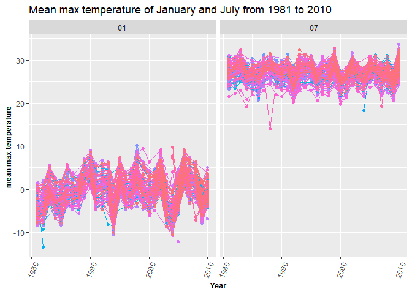
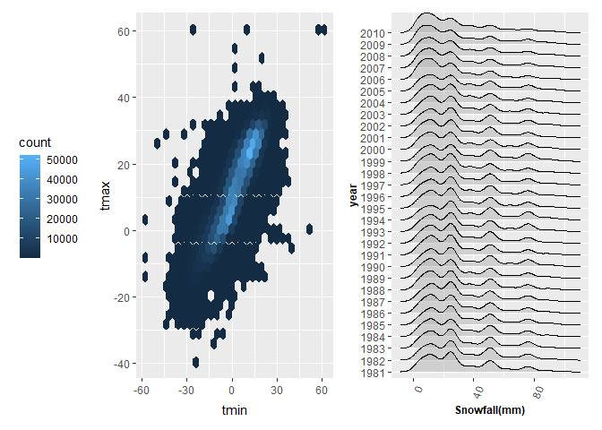

P8105_hw3_mc5296
================
2022-10-07

``` r
library(tidyverse)
```

    ## ── Attaching packages ─────────────────────────────────────── tidyverse 1.3.2 ──
    ## ✔ ggplot2 3.3.6      ✔ purrr   0.3.4 
    ## ✔ tibble  3.1.8      ✔ dplyr   1.0.10
    ## ✔ tidyr   1.2.0      ✔ stringr 1.4.1 
    ## ✔ readr   2.1.2      ✔ forcats 0.5.2 
    ## ── Conflicts ────────────────────────────────────────── tidyverse_conflicts() ──
    ## ✖ dplyr::filter() masks stats::filter()
    ## ✖ dplyr::lag()    masks stats::lag()

``` r
library(ggplot2)
library(patchwork)
```

# Problem 1

## Import Instacart

``` r
library(p8105.datasets) # Already installed datasets for the homework
data("instacart")
dim(instacart)
```

    ## [1] 1384617      15

``` r
head(instacart)
```

    ## # A tibble: 6 × 15
    ##   order_id product_id add_to_c…¹ reord…² user_id eval_…³ order…⁴ order…⁵ order…⁶
    ##      <int>      <int>      <int>   <int>   <int> <chr>     <int>   <int>   <int>
    ## 1        1      49302          1       1  112108 train         4       4      10
    ## 2        1      11109          2       1  112108 train         4       4      10
    ## 3        1      10246          3       0  112108 train         4       4      10
    ## 4        1      49683          4       0  112108 train         4       4      10
    ## 5        1      43633          5       1  112108 train         4       4      10
    ## 6        1      13176          6       0  112108 train         4       4      10
    ## # … with 6 more variables: days_since_prior_order <int>, product_name <chr>,
    ## #   aisle_id <int>, department_id <int>, aisle <chr>, department <chr>, and
    ## #   abbreviated variable names ¹​add_to_cart_order, ²​reordered, ³​eval_set,
    ## #   ⁴​order_number, ⁵​order_dow, ⁶​order_hour_of_day

The datasets has 1384617 rows(which means there are 1384617 orders), and
15 variables. The key variables is order_dow, order_hour, product name,
products’ aisle and department.

## EDA

``` r
instacart%>%
  count(aisle, name = "n_aisle") %>%
  arrange(desc(n_aisle)) # count the number of each of the aisle and arrange them in a decreasing order.
```

    ## # A tibble: 134 × 2
    ##    aisle                         n_aisle
    ##    <chr>                           <int>
    ##  1 fresh vegetables               150609
    ##  2 fresh fruits                   150473
    ##  3 packaged vegetables fruits      78493
    ##  4 yogurt                          55240
    ##  5 packaged cheese                 41699
    ##  6 water seltzer sparkling water   36617
    ##  7 milk                            32644
    ##  8 chips pretzels                  31269
    ##  9 soy lactosefree                 26240
    ## 10 bread                           23635
    ## # … with 124 more rows

There are 134 aisles. The fresh vegetables and fresh fruits are the item
most ordered.

``` r
instacart %>%
  count(aisle, name = "n_aisle") %>%
  arrange(desc(n_aisle)) %>%
  filter(n_aisle > 10000) %>% # select the aisles with more than 10000 items
ggplot(aes(x = aisle, y = n_aisle,width = 1)) +
  geom_bar(stat = "identity") + 
  theme(axis.title =  element_text(size=10,face = "bold"), # set the size of the xlabel
        axis.text.x = element_text(angle=70,  # rotate the xlabel
                                     hjust = 1)) # adjust the position of the xlabel text
```

<!-- -->

``` r
filtered_table <- instacart %>%
  select(aisle, product_name) %>%
  filter(aisle %in% c("baking ingredients", "dog food care", "packaged vegetables fruits"))%>% # select the row and column we need
  group_by(aisle,product_name) %>%
  summarize(n_product = n())  
```

    ## `summarise()` has grouped output by 'aisle'. You can override using the
    ## `.groups` argument.

``` r
filtered_table %>%
  group_by(aisle)%>%
  summarize(number_most_popular_items = max(n_product)) %>% # find the number of most popular item of each aisle
  left_join(filtered_table, c("number_most_popular_items" = "n_product","aisle" = "aisle")) #find the correspond items to the number of most popular item
```

    ## # A tibble: 3 × 3
    ##   aisle                      number_most_popular_items product_name             
    ##   <chr>                                          <int> <chr>                    
    ## 1 baking ingredients                               499 Light Brown Sugar        
    ## 2 dog food care                                     30 Snack Sticks Chicken & R…
    ## 3 packaged vegetables fruits                      9784 Organic Baby Spinach

As is shown in the table , the most popular item of baking ingredients
is light brown sugar, the most popular dog food care item is snack
sticks chicken & rice recipe dog treats

## Make a table showing the mean hour of the day at which Pink Lady Apples and Coffee Ice Cream are ordered on each day of the week; format this table for human readers

``` r
instacart %>%
  select(order_hour_of_day, order_dow, product_name) %>%
  filter(product_name %in% c("Pink Lady Apples", "Coffee Ice Cream"))%>% # we only need these two products
  group_by(product_name,order_dow)%>%
  summarise(mean_hour_of_the_day = mean(order_hour_of_day)) %>% # calculate the mean purchase hour for each pf the product pf each day in the week
  pivot_wider(
    names_from = order_dow,
    values_from = mean_hour_of_the_day
) %>%  # make the table more readable
  rename(Mean_hour_Sun = "0", Mean_hour_Mon = "1", Mean_hour_Tue="2", Mean_hour_Wed = "3", Mean_hour_Thu = "4", Mean_hour_Fri = "5", Mean_hour_Sat = "6")%>% 
  knitr::kable(digits = 1)
```

    ## `summarise()` has grouped output by 'product_name'. You can override using the
    ## `.groups` argument.

| product_name     | Mean_hour_Sun | Mean_hour_Mon | Mean_hour_Tue | Mean_hour_Wed | Mean_hour_Thu | Mean_hour_Fri | Mean_hour_Sat |
|:-----------------|--------------:|--------------:|--------------:|--------------:|--------------:|--------------:|--------------:|
| Coffee Ice Cream |          13.8 |          14.3 |          15.4 |          15.3 |          15.2 |          12.3 |          13.8 |
| Pink Lady Apples |          13.4 |          11.4 |          11.7 |          14.2 |          11.6 |          12.8 |          11.9 |

# P2

## Import data

``` r
accelerometer <- read.csv("data/accel_data.csv")
dim(accelerometer)
```

    ## [1]   35 1443

## Tidy and Wrangle the data

``` r
accelerometer %>%
  janitor::clean_names() %>%
  pivot_longer(activity_1:activity_1440,
               names_to = "minute_of_day",
               names_prefix = "activity.",
               values_to = "activity_count") %>% # convert the length and width to make the dataframe looks better.
  mutate(
    weekday_VS_weekend = ifelse(day %in% c("Saturday","Sunday"), "Weekend", "weekday")
  ) # seperate the  weekday and weekend
```

    ## # A tibble: 50,400 × 6
    ##     week day_id day    minute_of_day activity_count weekday_VS_weekend
    ##    <int>  <int> <chr>  <chr>                  <dbl> <chr>             
    ##  1     1      1 Friday 1                       88.4 weekday           
    ##  2     1      1 Friday 2                       82.2 weekday           
    ##  3     1      1 Friday 3                       64.4 weekday           
    ##  4     1      1 Friday 4                       70.0 weekday           
    ##  5     1      1 Friday 5                       75.0 weekday           
    ##  6     1      1 Friday 6                       66.3 weekday           
    ##  7     1      1 Friday 7                       53.8 weekday           
    ##  8     1      1 Friday 8                       47.8 weekday           
    ##  9     1      1 Friday 9                       55.5 weekday           
    ## 10     1      1 Friday 10                      43.0 weekday           
    ## # … with 50,390 more rows

The datasets has 50400 rows which records the data of activity of every
minute in 35days. It has the id of the week, day , day in a week, minute
of the day and the activity in the minute. \## Aggregate across minutes
to create a total activity variable for each day, and create a table
showing these totals.

``` r
accelerometer %>%
  janitor::clean_names() %>%
  pivot_longer(activity_1:activity_1440,
               names_to = "minute_of_day",
               names_prefix = "activity.",
               values_to = "activity_count") %>%
               group_by(week,day)%>%
               summarize(total_activity_day = sum(activity_count)) %>%
  arrange(total_activity_day)
```

    ## `summarise()` has grouped output by 'week'. You can override using the
    ## `.groups` argument.

    ## # A tibble: 35 × 3
    ## # Groups:   week [5]
    ##     week day       total_activity_day
    ##    <int> <chr>                  <dbl>
    ##  1     4 Saturday               1440 
    ##  2     5 Saturday               1440 
    ##  3     1 Monday                78828.
    ##  4     5 Sunday               138421 
    ##  5     4 Friday               154049 
    ##  6     4 Sunday               260617 
    ##  7     2 Monday               295431 
    ##  8     1 Tuesday              307094.
    ##  9     4 Tuesday              319568 
    ## 10     1 Wednesday            340115.
    ## # … with 25 more rows

As is shown in the table, there is no obvious trend. But there are two
days that are abnormal,which are the Saturday of the 4th and 5th week.
The activity count of every minute is 1. \## Make a single-panel plot
that shows the 24-hour activity time courses for each day and use color
to indicate day of the week.

``` r
accelerometer %>%
  janitor::clean_names() %>%
  pivot_longer(activity_1:activity_1440,
               names_to = "minute_of_day",
               names_prefix = "activity.",
               values_to = "activity_count") %>%
  ggplot(aes(x = as.numeric(minute_of_day), y = activity_count,color = day)) +
    geom_point() + geom_line() + labs(x = "minute of day")
```

<!-- --> As
is shown in the plot, the activity count is mostly low during night and
high during the day. It is especially high in the morning and evening.
\# P3 \## import the data

``` r
library(p8105.datasets)
data("ny_noaa")
head(ny_noaa)
```

    ## # A tibble: 6 × 7
    ##   id          date        prcp  snow  snwd tmax  tmin 
    ##   <chr>       <date>     <int> <int> <int> <chr> <chr>
    ## 1 US1NYAB0001 2007-11-01    NA    NA    NA <NA>  <NA> 
    ## 2 US1NYAB0001 2007-11-02    NA    NA    NA <NA>  <NA> 
    ## 3 US1NYAB0001 2007-11-03    NA    NA    NA <NA>  <NA> 
    ## 4 US1NYAB0001 2007-11-04    NA    NA    NA <NA>  <NA> 
    ## 5 US1NYAB0001 2007-11-05    NA    NA    NA <NA>  <NA> 
    ## 6 US1NYAB0001 2007-11-06    NA    NA    NA <NA>  <NA>

``` r
dim(ny_noaa)
```

    ## [1] 2595176       7

``` r
summary(ny_noaa)
```

    ##       id                 date                 prcp               snow       
    ##  Length:2595176     Min.   :1981-01-01   Min.   :    0.00   Min.   :  -13   
    ##  Class :character   1st Qu.:1988-11-29   1st Qu.:    0.00   1st Qu.:    0   
    ##  Mode  :character   Median :1997-01-21   Median :    0.00   Median :    0   
    ##                     Mean   :1997-01-01   Mean   :   29.82   Mean   :    5   
    ##                     3rd Qu.:2005-09-01   3rd Qu.:   23.00   3rd Qu.:    0   
    ##                     Max.   :2010-12-31   Max.   :22860.00   Max.   :10160   
    ##                                          NA's   :145838     NA's   :381221  
    ##       snwd            tmax               tmin          
    ##  Min.   :   0.0   Length:2595176     Length:2595176    
    ##  1st Qu.:   0.0   Class :character   Class :character  
    ##  Median :   0.0   Mode  :character   Mode  :character  
    ##  Mean   :  37.3                                        
    ##  3rd Qu.:   0.0                                        
    ##  Max.   :9195.0                                        
    ##  NA's   :591786

## Data cleaning

``` r
cleaned_noaa <- ny_noaa %>%
  separate(date, into = c("year","month","day"),sep = "-" ) %>%
  mutate(
    prcp = prcp/10,
    tmax = as.numeric(tmax)/10,
    tmin = as.numeric(tmin)/10  # make the units resonable
  ) 
summary(cleaned_noaa)
```

    ##       id                year              month               day           
    ##  Length:2595176     Length:2595176     Length:2595176     Length:2595176    
    ##  Class :character   Class :character   Class :character   Class :character  
    ##  Mode  :character   Mode  :character   Mode  :character   Mode  :character  
    ##                                                                             
    ##                                                                             
    ##                                                                             
    ##                                                                             
    ##       prcp              snow             snwd             tmax        
    ##  Min.   :   0.00   Min.   :  -13    Min.   :   0.0   Min.   :-38.9    
    ##  1st Qu.:   0.00   1st Qu.:    0    1st Qu.:   0.0   1st Qu.:  5.0    
    ##  Median :   0.00   Median :    0    Median :   0.0   Median : 15.0    
    ##  Mean   :   2.98   Mean   :    5    Mean   :  37.3   Mean   : 14.0    
    ##  3rd Qu.:   2.30   3rd Qu.:    0    3rd Qu.:   0.0   3rd Qu.: 23.3    
    ##  Max.   :2286.00   Max.   :10160    Max.   :9195.0   Max.   : 60.0    
    ##  NA's   :145838    NA's   :381221   NA's   :591786   NA's   :1134358  
    ##       tmin        
    ##  Min.   :-59.4    
    ##  1st Qu.: -3.9    
    ##  Median :  3.3    
    ##  Mean   :  3.0    
    ##  3rd Qu.: 11.1    
    ##  Max.   : 60.0    
    ##  NA's   :1134420

The most observation for snowfall is 0, for it is normal there is no
snow in most of a year and we expect to see snow only in winter.

## Make a two-panel plot showing the average max temperature in January and in July in each station across years

``` r
cleaned_noaa %>%
  filter(month %in% c("01","07"), !is.na(tmax)) %>%
  group_by(id,year,month)%>%
  summarize(
    mean_tmax = mean(tmax)
  ) %>%
ggplot(aes(x=year, y = mean_tmax, group = id, color = id))+
  geom_line()+
  facet_grid(.~ month)+
   theme(axis.title =  element_text(size=9,face = "bold"), # set the size of the xlabel
        axis.text.x = element_text(angle=70,  # rotate the xlabel
                                     hjust = 1)) # adjust the position of the xlabel text
```

    ## `summarise()` has grouped output by 'id', 'year'. You can override using the
    ## `.groups` argument.

<!-- -->

``` r
p1 <- cleaned_noaa %>%
  filter(!is.na(tmin), !is.na(tmax))%>%
  ggplot(aes(x = tmin, y = tmax))+
  geom_hex()

p2<- cleaned_noaa %>%
  filter(snow>0 & snow<100)%>%
  ggplot(aes(x = snow,fill = year)) +
  geom_density(alpha = 0.5)+
  theme(axis.title =  element_text(size=9,face = "bold"), # set the size of the xlabel
        axis.text.x = element_text(angle=70,  # rotate the xlabel
                                     hjust = 1)) # adjust the position of the xlabel text

p1 + p2
```

<!-- -->
